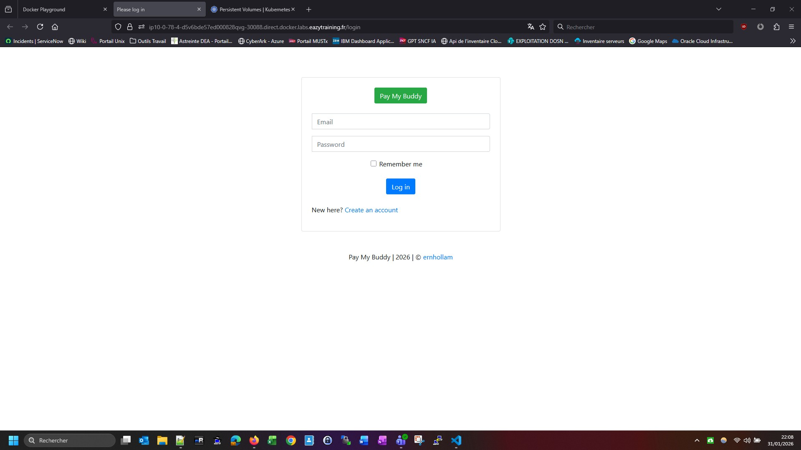
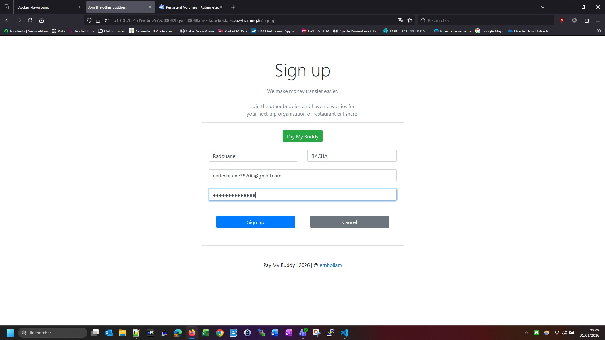
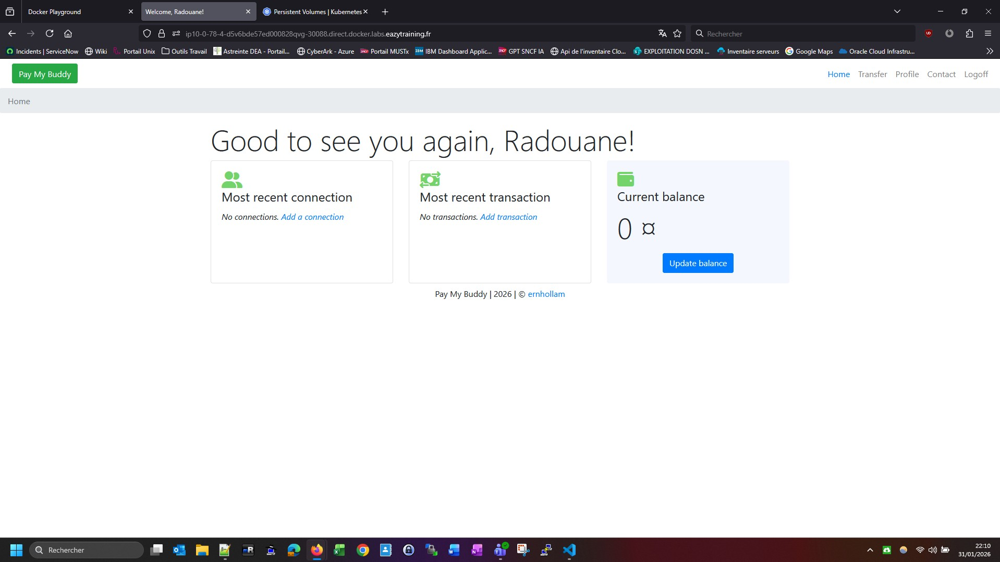
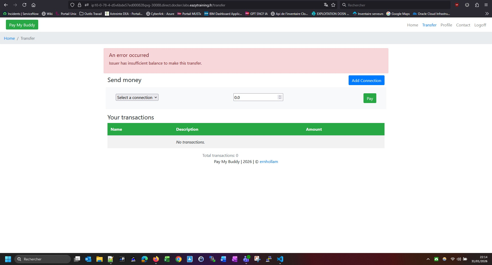

# 🚀 Mini-Projet Kubernetes — PayMyBuddy

Déploiement de l'application **PayMyBuddy** (SpringBoot + MySQL) en utilisant des manifests Kubernetes sans Helm.
Le but est de comprendre en détail comment déployer une application dans un cluster Kubernetes en écrivant
chaque manifest à la main.

---

## 📋 Prérequis

- Un cluster Kubernetes fonctionnel
- `kubectl` configuré et connecté au cluster
- Docker installé sur le nœud pour le build de l'image
- Accès SSH au nœud pour le volume `hostPath`

---

## 🏗️ Structure du projet

```
.
├── ns-paymybuddy.yml              # Définition du namespace
├── mysql-pv.yml                   # PersistentVolume (stockage sur le nœud via hostPath)
├── mysql-pvc.yml                  # PersistentVolumeClaim (demande de stockage)
├── paymybuddy-secrets.yml         # Secret Kubernetes (mot de passe MySQL en base64)
├── paymybuddy-configmap.yml       # ConfigMap (script SQL d'initialisation de la BDD)
├── mysql-deployment.yml           # Deployment du conteneur MySQL
├── mysql-clusterip.yml            # Service ClusterIP pour exposer MySQL en interne
├── paymybuddy-deployment.yaml     # Deployment de l'application SpringBoot
├── paymybuddy-nodeport.yml        # Service NodePort pour exposer PayMyBuddy vers l'extérieur
└── PayMyBuddy/                    # Dossier source de l'application SpringBoot
```

---

## ⚡ Déploiement étape par étape

### 1. Build de l'image Docker

Avant de déployer sur Kubernetes, il faut d'abord construire l'image Docker de l'application SpringBoot.
On se place dans le dossier `PayMyBuddy` qui contient le `Dockerfile` et on lance le build.

```bash
$ cd PayMyBuddy
$ docker build -t paymybuddy:latest .
[+] Building 12.9s (7/8)
 => [1/3] FROM docker.io/library/amazoncorretto:17-alpine       9.1s
 => [2/3] WORKDIR /app                                           0.4s
 => [3/3] COPY target/paymybuddy.jar paymybuddy.jar              1.1s
 => => naming to docker.io/library/paymybuddy:latest             0.0s
```

On vérifie que l'image a bien été créée :

```bash
$ docker images | grep paymybuddy
paymybuddy   latest   8f8e9fa9b48e   14 seconds ago   340MB
```

On retourne au répertoire racine du projet :

```bash
$ cd ..
$ ls -rtlh
total 40K
-rw-r--r--. 1 root root  163 Jan 31 20:30 paymybuddy-secrets.yml
-rw-r--r--. 1 root root  237 Jan 31 20:30 paymybuddy-nodeport.yml
-rw-r--r--. 1 root root  877 Jan 31 20:30 paymybuddy-deployment.yaml
-rw-r--r--. 1 root root 3.7K Jan 31 20:30 paymybuddy-configmap.yml
-rw-r--r--. 1 root root  111 Jan 31 20:30 ns-paymybuddy.yml
-rw-r--r--. 1 root root  245 Jan 31 20:30 mysql-pvc.yml
-rw-r--r--. 1 root root  302 Jan 31 20:30 mysql-pv.yml
-rw-r--r--. 1 root root 1.1K Jan 31 20:30 mysql-deployment.yml
-rw-r--r--. 1 root root  209 Jan 31 20:30 mysql-clusterip.yml
-rw-r--r--. 1 root root 1.4K Jan 31 20:30 README.md
drwxr-xr-x. 5 root root   78 Jan 31 20:34 PayMyBuddy
```

---

### 2. Création du Namespace

Un namespace permet d'isoler les ressources Kubernetes. Toutes nos ressources seront déployées dans le namespace `paymybuddy`.

```bash
$ kubectl apply -f ns-paymybuddy.yml
namespace/paymybuddy created

$ kubectl get ns paymybuddy
NAME         STATUS   AGE
paymybuddy   Active   25s
```

Le namespace est bien créé et actif.

---

### 3. Création du PersistentVolume (PV)

Le PersistentVolume représente un espace de stockage physique sur le nœud. On utilise un `hostPath` qui stocke les données MySQL directement dans le répertoire `/data/mysql` du nœud.
Cela permet de persister les données même si le pod MySQL est redémarré.

```bash
$ kubectl apply -f mysql-pv.yml
persistentvolume/mysql-pv created

$ kubectl get pv mysql-pv
NAME       CAPACITY   ACCESS MODES   RECLAIM POLICY   STATUS      CLAIM   STORAGECLASS   AGE
mysql-pv   1Gi        RWO            Delete           Available           manual         10s
```

Le PV est en statut `Available`, il attend d'être utilisé.

---

### 4. Création du PersistentVolumeClaim (PVC)

Le PVC est une demande de stockage émise par un pod. Il se lie automatiquement à un PV compatible.
Dans notre cas, il se lie au PV `mysql-pv` créé précédemment.

```bash
$ kubectl apply -f mysql-pvc.yml
persistentvolumeclaim/mysql-pvc created

$ kubectl get pvc mysql-pvc -n paymybuddy
NAME        STATUS   VOLUME     CAPACITY   ACCESS MODES   STORAGECLASS   AGE
mysql-pvc   Bound    mysql-pv   1Gi        RWO            manual         2s

$ kubectl get pv mysql-pv
NAME       CAPACITY   ACCESS MODES   RECLAIM POLICY   STATUS   CLAIM                  STORAGECLASS   AGE
mysql-pv   1Gi        RWO            Delete           Bound    paymybuddy/mysql-pvc   manual         32s
```

Le PVC est bien en statut `Bound` (lié) au PV `mysql-pv`. Le stockage est prêt à être utilisé.

---

### 5. Création du ConfigMap

Le ConfigMap contient le script SQL `init.sql` qui sera utilisé pour initialiser la base de données MySQL
au premier démarrage. Ce script crée les tables (`user`, `bank_account`, `connection`, `transaction`)
et insère les données initiales.

```bash
$ kubectl apply -f paymybuddy-configmap.yml
configmap/mysql-init-script created

$ kubectl get configmap -n paymybuddy
NAME                DATA   AGE
mysql-init-script   1      1s
```

---

### 6. Création du Secret

Le Secret contient le mot de passe MySQL encodé en base64. On évite de mettre le mot de passe en clair dans les manifests pour raisons de sécurité.

```bash
$ kubectl apply -f paymybuddy-secrets.yml
secret/paymybuddy-secrets created

$ kubectl get secrets -n paymybuddy
NAME                  TYPE                                  DATA   AGE
default-token-97mwf   kubernetes.io/service-account-token   3      4m8s
paymybuddy-secrets    Opaque                                1      9s

$ kubectl describe secrets paymybuddy-secrets -n paymybuddy
Name:         paymybuddy-secrets
Namespace:    paymybuddy
Type:         Opaque
Data
====
mysql_root_password:  8 bytes
```

On peut voir que le secret contient bien la clé `mysql_root_password` (8 bytes correspond à notre mot de passe encodé).

---

### 7. Déploiement MySQL

On applique le Deployment MySQL qui :
- Utilise l'image `mysql:8.0`
- Monte le PVC pour persister les données dans `/var/lib/mysql`
- Monte le ConfigMap dans `/docker-entrypoint-initdb.d/` pour exécuter le script d'init au premier démarrage
- Récupère le mot de passe depuis le Secret

```bash
$ kubectl apply -f mysql-deployment.yml
deployment.apps/mysql created

$ kubectl get deploy -n paymybuddy
NAME    READY   UP-TO-DATE   AVAILABLE   AGE
mysql   0/1     1            0           9s

$ kubectl get pods -n paymybuddy
NAME                     READY   STATUS    RESTARTS   AGE
mysql-5788b48887-9jf6t   1/1     Running   0          25s
```

Le pod MySQL est bien en statut `Running`.

#### Vérification des logs MySQL

On vérifie dans les logs que le script d'initialisation a bien été exécuté :

```bash
$ kubectl logs mysql-5788b48887-9jf6t -n paymybuddy
...
2026-01-31 21:05:22+00:00 [Note] [Entrypoint]: Initializing database files
...
2026-01-31 21:05:37+00:00 [Note] [Entrypoint]: Database files initialized
2026-01-31 21:05:37+00:00 [Note] [Entrypoint]: Starting temporary server
...
2026-01-31 21:05:40+00:00 [Note] [Entrypoint]: Creating database db_paymybuddy
2026-01-31 21:05:41+00:00 [Note] [Entrypoint]: /usr/local/bin/docker-entrypoint.sh: running /docker-entrypoint-initdb.d/init.sql
...
2026-01-31 21:05:43+00:00 [Note] [Entrypoint]: MySQL init process done. Ready for start up.
...
2026-01-31T21:05:44.071271Z 0 [System] [MY-010931] [Server] /usr/sbin/mysqld: ready for connections. port: 3306
```

La ligne clé est : `running /docker-entrypoint-initdb.d/init.sql` qui confirme que le script a été exécuté avec succès.

> **Note importante** : Le script `init.sql` ne s'exécute qu'une seule fois, à la première initialisation de MySQL, lorsque le répertoire `/var/lib/mysql` est encore vide. Si vous devez relancer l'initialisation, vous devez supprimer le PV et le PVC puis les recréer.

#### Vérification de la base de données et des tables

On se connecte directement au conteneur MySQL pour vérifier que la base et les tables ont bien été créées :

```bash
$ kubectl exec -it deployment/mysql -n paymybuddy -- bash -c 'mysql -uroot -p${MYSQL_ROOT_PASSWORD} -e "SHOW DATABASES;"'
+--------------------+
| Database           |
+--------------------+
| db_paymybuddy      |
| information_schema |
| mysql              |
| performance_schema |
| sys                |
+--------------------+

$ kubectl exec -it deployment/mysql -n paymybuddy -- bash -c 'mysql -uroot -p${MYSQL_ROOT_PASSWORD} db_paymybuddy -e "SHOW TABLES;"'
+-------------------------+
| Tables_in_db_paymybuddy |
+-------------------------+
| bank_account            |
| connection              |
| transaction             |
| user                    |
+-------------------------+
```

La base `db_paymybuddy` existe et les 4 tables sont bien créées.

---

### 8. Service ClusterIP pour MySQL

Le service ClusterIP permet aux autres pods du cluster de se connecter à MySQL via une adresse IP interne stable.
L'application PayMyBuddy utilisera cette IP pour se connecter à la base de données.

```bash
$ kubectl apply -f mysql-clusterip.yml
service/mysql created

$ kubectl get svc -n paymybuddy
NAME    TYPE        CLUSTER-IP       EXTERNAL-IP   PORT(S)    AGE
mysql   ClusterIP   10.109.213.107   <none>        3306/TCP   17s
```

MySQL est maintenant accessible à l'adresse `10.109.213.107:3306` à l'intérieur du cluster.

---

### 9. Déploiement PayMyBuddy

On déploie l'application SpringBoot qui se connecte à MySQL via le service ClusterIP créé précédemment.
Le Deployment utilise l'image `paymybuddy:latest` buildée au début.

```bash
$ kubectl apply -f paymybuddy-deployment.yaml
deployment.apps/paymybuddy created

$ kubectl get deploy -n paymybuddy
NAME         READY   UP-TO-DATE   AVAILABLE   AGE
mysql        1/1     1            1           2m21s
paymybuddy   1/1     1            1           4s

$ kubectl get pods -n paymybuddy
NAME                          READY   STATUS    RESTARTS   AGE
mysql-5788b48887-9jf6t        1/1     Running   0          2m43s
paymybuddy-58f8d76689-9rcfl   1/1     Running   0          26s
```

Les deux pods sont en statut `Running` et `READY 1/1`.

---

#### Vérification des logs de démarrage SpringBoot

```bash
[node1 mini-projet-kubernetes-commun]$ kubectl logs paymybuddy-98596bb74-ldcnp -n paymybuddy

  .   ____          _            __ _ _
 /\\ / ___'_ __ _ _(_)_ __  __ _ \ \ \ \
( ( )\___ | '_ | '_| | '_ \/ _` | \ \ \ \
 \\/  ___)| |_)| | | | | || (_| |  ) ) ) )
  '  |____| .__|_| |_|_| |_\__, | / / / /
 =========|_|==============|___/=/_/_/_/
 :: Spring Boot ::                (v2.7.1)

2026-02-19 13:11:31.113  INFO 1 --- [           main] c.p.paymybuddy.PayMyBuddyApplication     : Starting PayMyBuddyApplication v0.0.1-SNAPSHOT using Java 17.0.18 on paymybuddy-98596bb74-ldcnp with PID 1 (/app/paymybuddy.jar started by root in /app)
2026-02-19 13:11:31.145  INFO 1 --- [           main] c.p.paymybuddy.PayMyBuddyApplication     : No active profile set, falling back to 1 default profile: "default"
2026-02-19 13:11:33.199  INFO 1 --- [           main] .s.d.r.c.RepositoryConfigurationDelegate : Bootstrapping Spring Data JPA repositories in DEFAULT mode.
2026-02-19 13:11:33.297  INFO 1 --- [           main] .s.d.r.c.RepositoryConfigurationDelegate : Finished Spring Data repository scanning in 82 ms. Found 4 JPA repository interfaces.
2026-02-19 13:11:34.863  INFO 1 --- [           main] o.s.b.w.embedded.tomcat.TomcatWebServer  : Tomcat initialized with port(s): 8080 (http)
2026-02-19 13:11:34.884  INFO 1 --- [           main] o.apache.catalina.core.StandardService   : Starting service [Tomcat]
2026-02-19 13:11:34.884  INFO 1 --- [           main] org.apache.catalina.core.StandardEngine  : Starting Servlet engine: [Apache Tomcat/9.0.64]
2026-02-19 13:11:35.064  INFO 1 --- [           main] o.a.c.c.C.[Tomcat].[localhost].[/]       : Initializing Spring embedded WebApplicationContext
2026-02-19 13:11:35.064  INFO 1 --- [           main] w.s.c.ServletWebServerApplicationContext : Root WebApplicationContext: initialization completed in 3704 ms
2026-02-19 13:11:35.481  INFO 1 --- [           main] com.zaxxer.hikari.HikariDataSource       : HikariPool-1 - Starting...
2026-02-19 13:11:36.321  INFO 1 --- [           main] com.zaxxer.hikari.HikariDataSource       : HikariPool-1 - Start completed.
2026-02-19 13:11:36.468  INFO 1 --- [           main] o.hibernate.jpa.internal.util.LogHelper  : HHH000204: Processing PersistenceUnitInfo [name: default]
2026-02-19 13:11:36.729  INFO 1 --- [           main] org.hibernate.Version                    : HHH000412: Hibernate ORM core version 5.6.9.Final
2026-02-19 13:11:37.296  INFO 1 --- [           main] o.hibernate.annotations.common.Version   : HCANN000001: Hibernate Commons Annotations {5.1.2.Final}
2026-02-19 13:11:37.514  INFO 1 --- [           main] org.hibernate.dialect.Dialect            : HHH000400: Using dialect: org.hibernate.dialect.MySQL8Dialect
2026-02-19 13:11:38.658  INFO 1 --- [           main] o.h.e.t.j.p.i.JtaPlatformInitiator       : HHH000490: Using JtaPlatform implementation: [org.hibernate.engine.transaction.jta.platform.internal.NoJtaPlatform]
2026-02-19 13:11:38.672  INFO 1 --- [           main] j.LocalContainerEntityManagerFactoryBean : Initialized JPA EntityManagerFactory for persistence unit 'default'
2026-02-19 13:11:39.903  WARN 1 --- [           main] JpaBaseConfiguration$JpaWebConfiguration : spring.jpa.open-in-view is enabled by default. Therefore, database queries may be performed during view rendering. Explicitly configure spring.jpa.open-in-view to disable this warning
2026-02-19 13:11:40.311  INFO 1 --- [           main] o.s.s.web.DefaultSecurityFilterChain     : Will secure any request with [org.springframework.security.web.session.DisableEncodeUrlFilter@3b5c665c, org.springframework.security.web.context.request.async.WebAsyncManagerIntegrationFilter@78e17a99, org.springframework.security.web.context.SecurityContextPersistenceFilter@650ae78c, org.springframework.security.web.header.HeaderWriterFilter@5c83ae01, org.springframework.security.web.csrf.CsrfFilter@7d0d91a1, org.springframework.security.web.authentication.logout.LogoutFilter@12fe1f28, org.springframework.security.web.authentication.UsernamePasswordAuthenticationFilter@655a01d8, org.springframework.security.web.savedrequest.RequestCacheAwareFilter@79c5460e, org.springframework.security.web.servletapi.SecurityContextHolderAwareRequestFilter@4f94e148, org.springframework.security.web.authentication.rememberme.RememberMeAuthenticationFilter@6614bd4b, org.springframework.security.web.authentication.AnonymousAuthenticationFilter@625a4ff, org.springframework.security.web.session.SessionManagementFilter@69d45cca, org.springframework.security.web.access.ExceptionTranslationFilter@4190bc8a, org.springframework.security.web.access.intercept.AuthorizationFilter@1507c3c3]
2026-02-19 13:11:40.335  WARN 1 --- [           main] o.s.s.c.a.web.builders.WebSecurity       : You are asking Spring Security to ignore Ant [pattern='/images/**']. This is not recommended -- please use permitAll via HttpSecurity#authorizeHttpRequests instead.
2026-02-19 13:11:40.335  INFO 1 --- [           main] o.s.s.web.DefaultSecurityFilterChain     : Will not secure Ant [pattern='/images/**']
2026-02-19 13:11:40.336  WARN 1 --- [           main] o.s.s.c.a.web.builders.WebSecurity       : You are asking Spring Security to ignore Ant [pattern='/js/**']. This is not recommended -- please use permitAll via HttpSecurity#authorizeHttpRequests instead.
2026-02-19 13:11:40.336  INFO 1 --- [           main] o.s.s.web.DefaultSecurityFilterChain     : Will not secure Ant [pattern='/js/**']
2026-02-19 13:11:40.336  WARN 1 --- [           main] o.s.s.c.a.web.builders.WebSecurity       : You are asking Spring Security to ignore Ant [pattern='/webjars/**']. This is not recommended -- please use permitAll via HttpSecurity#authorizeHttpRequests instead.
2026-02-19 13:11:40.336  INFO 1 --- [           main] o.s.s.web.DefaultSecurityFilterChain     : Will not secure Ant [pattern='/webjars/**']
2026-02-19 13:11:40.763  INFO 1 --- [           main] o.s.b.w.embedded.tomcat.TomcatWebServer  : Tomcat started on port(s): 8080 (http) with context path ''
2026-02-19 13:11:40.783  INFO 1 --- [           main] c.p.paymybuddy.PayMyBuddyApplication     : Started PayMyBuddyApplication in 10.73 seconds (JVM running for 11.617)
2026-02-19 13:11:46.856  INFO 1 --- [nio-8080-exec-1] o.a.c.c.C.[Tomcat].[localhost].[/]       : Initializing Spring DispatcherServlet 'dispatcherServlet'
2026-02-19 13:11:46.856  INFO 1 --- [nio-8080-exec-1] o.s.web.servlet.DispatcherServlet        : Initializing Servlet 'dispatcherServlet'
2026-02-19 13:11:46.858  INFO 1 --- [nio-8080-exec-1] o.s.web.servlet.DispatcherServlet        : Completed initialization in 2 ms
2026-02-19 13:13:19.046  INFO 1 --- [nio-8080-exec-6] c.p.p.service.TransactionService         : Transactions with narlechitane38200@gmail.com:
```
---


### 10. Service NodePort pour PayMyBuddy

Le service NodePort expose l'application vers l'extérieur du cluster. Il attribue un port sur chaque nœud
du cluster qui redirige le trafic vers le pod PayMyBuddy.

```bash
$ kubectl apply -f paymybuddy-nodeport.yml
service/paymybuddy created

$ kubectl get svc -n paymybuddy
NAME         TYPE        CLUSTER-IP       EXTERNAL-IP   PORT(S)          AGE
mysql        ClusterIP   10.109.213.107   <none>        3306/TCP         57s
paymybuddy   NodePort    10.102.82.218    <none>        8080:30088/TCP   2s
```

Le service expose le port `8080` de l'application sur le port `30088` du nœud.

---

## 🌐 Accès à l'application

L'application est accessible depuis un navigateur via :
```bash
http://<IP-du-nœud>:30088
```

Voici quelques captures d'écran de l'application en cours d'exécution :









---

## 🏅 Résumé final

À la fin du déploiement, voici l'état de toutes les ressources :

| Ressource | Statut | Description |
|-----------|--------|-------------|
| Namespace `paymybuddy` | ✅ Active | Espace isolé pour nos ressources |
| PV `mysql-pv` | ✅ Bound | Stockage physique sur le nœud (`/data/mysql`) |
| PVC `mysql-pvc` | ✅ Bound | Lié au PV `mysql-pv` |
| ConfigMap `mysql-init-script` | ✅ Créé | Script SQL d'initialisation |
| Secret `paymybuddy-secrets` | ✅ Créé | Mot de passe MySQL (base64) |
| Deployment `mysql` | ✅ 1/1 Ready | Base de données MySQL |
| Service `mysql` (ClusterIP) | ✅ 3306/TCP | Accès interne à MySQL |
| Deployment `paymybuddy` | ✅ 1/1 Ready | Application SpringBoot |
| Service `paymybuddy` (NodePort) | ✅ 8080:30088/TCP | Accès externe à l'application |
